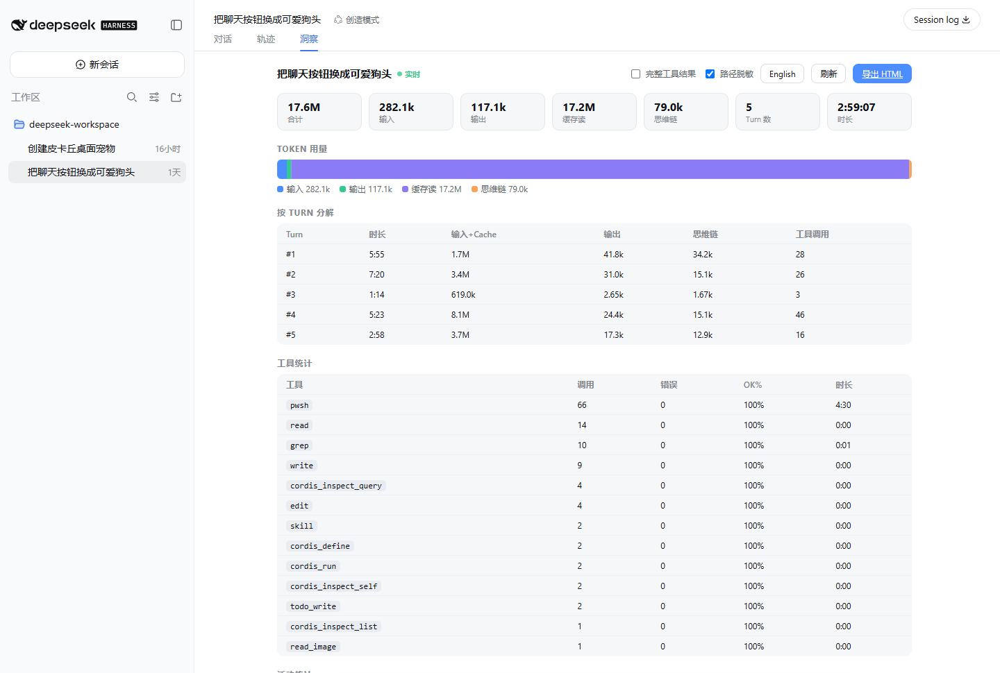
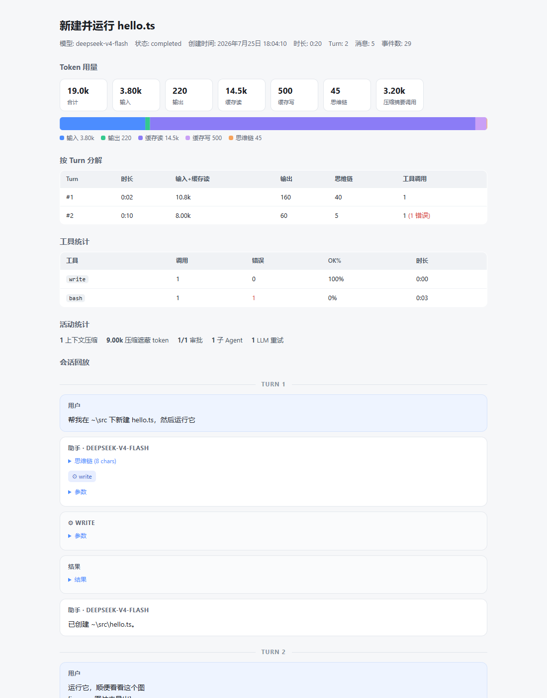

# dsh-session-lens

[中文](README.md)

[](https://github.com/bobostudio/dsh-session-lens/actions/workflows/ci.yml)
[](#compatibility)
[](LICENSE)

**Session insights and one-click shareable HTML replay for DeepSeek Harness (DSH).** Generate a deep "health report" for any session, and export it as a **self-contained single-file HTML replay** — opens offline, easy to share, zero external dependencies.

[](https://dshfind.com/en/plugins/bobostudio/dsh-session-lens?ref=badge)

> Complements the official Trajectory view: Trajectory shows the raw event stream; Lens adds **aggregated analytics** (token breakdown, per-turn timeline, tool stats) and **sharing**.

## Features

**📊 Insights view (new session tab)**

- 5-way token breakdown: input / output / cache read / cache write / reasoning (compaction calls listed separately)
- Per-turn breakdown: duration, tokens, tool calls, errors
- Tool stats: calls, error rate, wall-clock time
- Activity: compactions, approvals, subagents, LLM retries
- Auto-refreshes every 5s while the session is live

**📤 One-click HTML export**

- Single file, zero JavaScript, zero network requests: inline SVG charts, native `<details>` collapsibles
- Full replay: user messages, assistant replies, reasoning (collapsible), tool calls & results, approval/compaction/subagent markers
- Bilingual chrome (zh/en selectable at export)

**🔒 Privacy-first (structural guarantees)**

- **System prompt can never leak**: the export renders only whitelisted "story events" — `request/header` and internal LLM plumbing cannot reach the file
- Tool arguments/results truncated by default (2,000 chars) to avoid leaking file contents; full mode optional
- Local paths masked as `~`: the session cwd + user home directory (all slash, drive-letter-case and JSON-escaped variants). Absolute paths outside the cwd (e.g. sibling repo dirs) are kept as-is for readability
- Image attachments never leave the machine
- CSP `default-src 'none'`: the export has no scripting capability at all

## Install

```bash
dsh plugin --profile web add github:bobostudio/dsh-session-lens
```

Restart DSH Web, open any session, and click the **Lens** tab next to Chat / Trajectory.

## Preview

These shots were taken from a live DSH Web session (`http://127.0.0.1:17893/`). After you open a session, **Lens** sits next to Chat / Trajectory:



How to read it:

- **17.6M tokens total**, of which 17.2M is purple cache-read — later turns are riding the prefix cache, not paying the full input again
- **Per-turn breakdown** shows which round was expensive: turn 4 burned 8.1M input+cache and 46 tool calls; turn 3 finished in 1:14 with 3 calls
- **Tool stats** are sorted by call count: wall-clock here is dominated by `pwsh` (66 calls / 4m30s); file reads and writes are essentially free

**Export HTML** downloads a single-file report (no JavaScript, opens offline). The in-repo sample below has the same analytics plus a full replay, including a tool error, an approval, and a compaction marker:



Clickable samples: [docs/example.html](docs/example.html) · [docs/example.en.html](docs/example.en.html)

## Usage

1. Open a session → the **Lens** tab shows live analytics
2. Click **Export HTML** to download the single-file report
3. Export options (remembered): full tool results (off), path masking (on), theme (dark / system / light, default dark), export language (zh/en)

## Compatibility

Targets `@deepseek-ai/dsh >= 0.1.0-rc.6`, `web` profile. DSH is in developer preview; internal seams (`sessions` / `sessionPersistence` / the `conversation.view` slot) may change between releases — all optional services degrade gracefully. Please file an issue if an upgrade breaks something.

## Development

```bash
npm install
npm run build     # esbuild → lib/ (Node half + client half)
npm test          # 44 unit/integration tests (node:test, no build needed)
npm run check     # tsc --noEmit
```

## License

[MIT](LICENSE)
